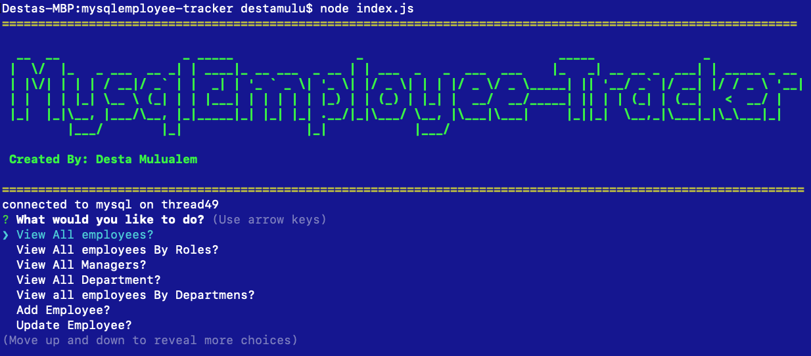

# mysqlemployee-tracker

## License
   

  
   # Table of Contents

   * [Description](#Description)

   * [Runing a command-line application ](#Runing-a-command-line-application) 

   * [Installation Instructions](#installation-instructions)
  
   * [Usage Instructions](#usage-instructions)
  
   * [Contribution](#Contribution)
  
   * [Developers Contact Information](#Developers-Contact-Information)

   * [License](#license)

   # Description

   * This application is developed to help for non-developers to view and interact with information stored in databases. project managers,even to every body  that can be used to write clearly and briefly, save, and delete datase.
   * This application uses an express backend and save and retrieve node data from a mysql. .

   * Non Developers or users can quickly and easily can manege their employees as well as

   * Add departments, roles, employees. 

   * View departments, roles, employees.

   * Update employee roles

   #  Runing a command-line application 

   * You can Update employee managers.
   * You can View employees by manager.
   * You can Delete departments, roles, and employees.

   * You can View the total utilized budget of a department ie the combined salaries of all employees in that department

   * The app runs as a `index.js` to gather information about each employees. 

   * you can quickly create or taken notes.

   * My employee-tracker application includes all necessary code that is readable, reliable, and maintainable Oftentimes, node_modules,  main Readme, screenshot images, and video.

   * I put my LinkedIn profile, my github URL repository, heroku url and email address working activly.

   ## Installation Instructions

   * The developer is authorizing a free installation by cloning from the repository code:- 

   * [destish21/mysqlemployee-tracker](https://github.com/destish21/mysqlemployee-tracker)

   * you can run by install npm i to include node_module, inquirer, and mysql.

   * you can run by node index.js to mysqlemployee-tracker.

   # screenshot Images
   * 

   <!-- *  -->

   * 
   
   * 

   ## Usage Instructions

   * For this app to run make sure first 
   intall all necessary  node_moduales like inquirer, mysql, and console.tble.

   * make sure creat repository in your github.

   * Clone the code from my github repository 

   * [destish21/mysqlemployee-tracker](https://github.com/destish21/mysqlemployee-tracker)
 
   * mysqlemployee-tracker and clone it in your comand line.

   * Make sure node_modules run by `npm i or npm install`
     in your computer.

   * Once in the directory run npm install to install the node_modules needed to run the app.
    Run by  `node index.js`.

   * You will be write notes on the application.

   * A `mysqlemployee-tracker Completed wrote the  file !!`  will be desplayed after you wrote your note. 

   * you will see a high-quality, professional `mysqlemployee-tracker` is generated with the title of my project.

   * you can manage the departments, roles, and employees in your company.

   * you can organize and plan your business then do it now by commandline. 
        by `node index.js`.

   * I built with diferent package to connect to your MySQL database and perform queries`db` file and return all files.

   * InquirerJs package to interact with the user via the command-line.

   * console.table to print MySQL rows to the console. There is a built-in version of `console.table`,

   * you can to be able to write and save datase.

   * you can to be able to delete and Update  you've written before.

   * you can  quickly access to emails and GitHub profiles.

   * My `mysqlemployee-tracker` is in my github repository enjoy it!

   * Test Screenshot image 
 
   
  
   ### Click the  links to wach video 1 and video 2 demonstration:  

   * [Watch the video 1 ](https://drive.google.com/file/d/1n67AuDdYe4XNGFX4q0A5VfpPEFfHYZFF/view?usp=sharing)
  
   * [Watch the video 2](https://drive.google.com/file/d/1QeEtYFUPniLX8ZqN8y_NJk6BcEOSqoMB/view?usp=sharing)
    

   ## Contribution
  
   * This is Contributed by [destish21/mysqlemployee-tracker](https://github.com/destish21/mysqlemployee-tracker). 
   
   * But Contribution, issues and feature requests are welcome.
   * Feel free to check issues page if you want to contribute. 
   * you can contact me by Contact Information here below.

   ## Developers Contact Information
   * LinkdIn Profile: [Desta Mulualem](https://www.linkedin.com/in/desta-mulualem-6718b1203/)
   * Deployed URL :  N/A
   * github URL:  https://github.com/destish21/mysqlemployee-tracker

   * Email: destish21@yahoo.com
   
   * © 2019 Trilogy Education Services, a 2U, Inc. brand. All Rights Reserved.
